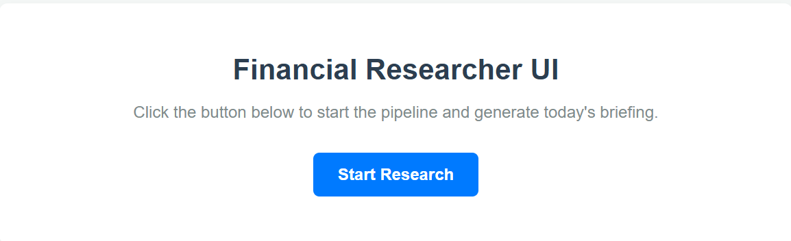
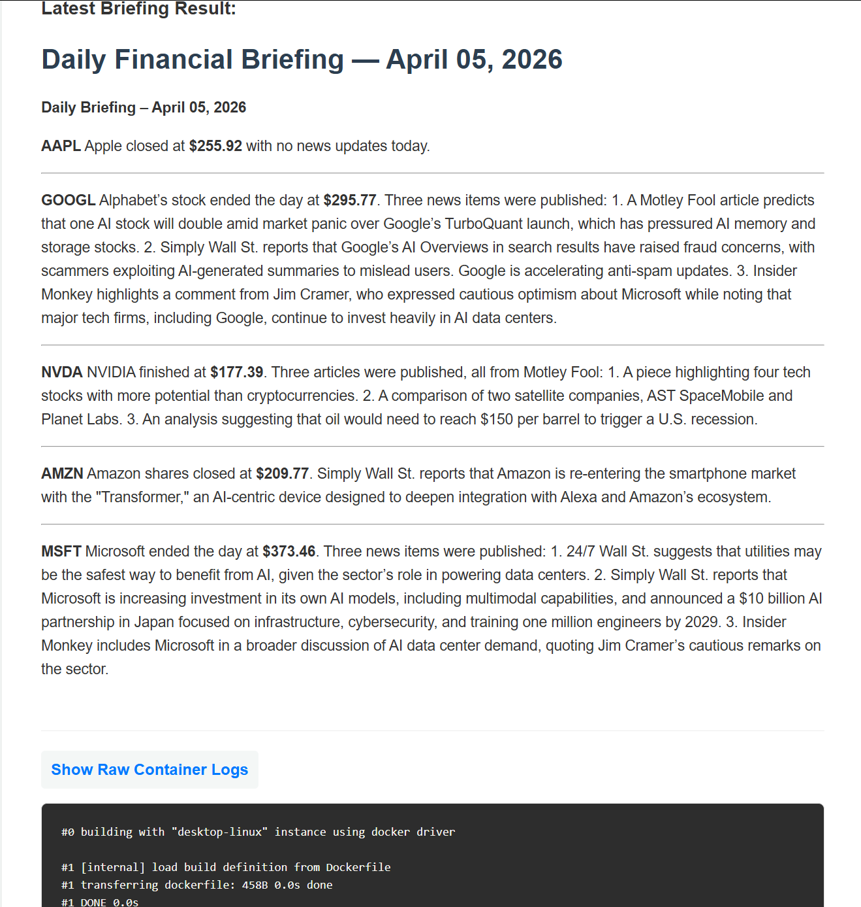

# Autonomous Financial Researcher

A Python-based agent that generates a daily financial briefing for a configurable stock watchlist. 
It reads a list of tickers from a local file, fetches current prices and retrieves relevant news for each ticker, and uses LLM to write a structured markdown report.

We built this tool to automate the repetitive financial research commonly done by traders, and to demonstrate how the Model Context Protocol (MCP) serves as a clean interface between an LLM and its external tools.


## Goal

- **Input:** `data/input/watchlist.csv` - a list of stock tickers which is configurable based on each user
- **Output:** `data/output/briefing_{{ddmmyy}}.md` - a formatted Markdown report generated by the LLM

## Setup & Dependencies
#### Prerequisites: 
- Python 3.10+
- Docker Desktop (Must be installed and running)

#### Installing Python Dependencies
Before installing any dependencies, it is highly recommended to create a virtual environment, there are many ways for that, this can be done with the following command:
```bash
python -m venv .venv
```

Requirements need to be installed for both the main pipeline and the UI.
```bash
pip install -r requirements.txt
````

#### Configuring Environment Variables
Copy the provided .env.example file to create your local .env file.
```bash
cp .env.example .env
````
And then open this .env file and make sure you are satisfied with the default Port configurations.
You will also need to input your Mistral API key for the variable "MISTRAL_API_KEY".

#### Edit Your Watchlist
You can open your `data/input/watchlist.csv` and add or change any of the default tickers already present there.

## How to Run the App (Web UI)

The easiest way to run the tool is via the built-in web interface. This UI automatically builds and runs the Docker container in the background.
This can be done through the command:
```bash
python ui.py
```

Once that is done, you will be prompted to open a link.
If you are using the default configuration, the web UI will be accessed through:
`http://127.0.0.1:5000`

You will open a page similar to the following:



Click on "Start Research", and once the container finishes running, you will be able to view the daily briefing, as well as a dropdown of the generated logs in case any error occured.



## How to Run Manually using Docker CLI

In case you prefer to avoid using the UI and just run the pipeline from the terminal, you will need to:

1- Build the Docker Image:
```bash
docker build -t financial-researcher .
```

2- Run the container by passing the env file and mounting the data folder:
```bash
docker run --rm --env-file .env -v $(pwd)/data:/app/data financial-researcher
```
Logs are directly streamed to the terminal as this docker run command doesn't use the `-d` detached flag.
The output will be saved under `data/output/briefing_{{ddmmyy}}.md`

## Tests

### Automated Integration Tests
We included basic integration tests for each tool to validate that each tool runs properly 
in case any changes or enrichments were to be made to the code.

To run all three integrations tests together at once, run:
```bash
PYTHONPATH=. .venv/bin/pytest tests/ -v
```

If you specify the exact file, you can run the integration tests individually. 

#### Stock Price FastMCP Integration:
```bash
PYTHONPATH=. .venv/bin/pytest tests/test_stock_price.py -v
```

#### News Tool FastMCP Integration:
```bash
PYTHONPATH=. .venv/bin/pytest tests/test_news.py -v
```

#### Watchlist Loader Integration:
```bash
PYTHONPATH=. .venv/bin/pytest tests/test_watchlist.py -v
```

### Manual MCP Tool Testing
You can manually test individual MCP tools via the MCP Inspector before running the entire chain.

#### For Any of the Tools:
1. Run the tool server:
```bash
python -m src.tools.news
```
or
```bash
python -m src.tools.watchlist
```
or
```bash
python -m src.tools.stock_price
```
2. In a new terminal, launch the inspector:
```bash
npx @modelcontextprotocol/inspector
```
3. Open the browser link provided, put the URL `http://{{HOST}}{{PORT}}}`, select the `SSE` transport, and test the tool by selecting the function name.

*(Note: If relying on the default configuration, the Host is `127.0.0.1`, the Watchlist tool runs on port `8000`, the Stock Price tool runs on port `8001`, and the News tool runs on port `8002`)*

## Team
This project was executed with the collaboration of the following team members:

Andrew BEJJANI  
Sanchay BHUTANI  
Vishakh SHAH  
Sagar VISHISHTA
